# Defect Report – Visitor Check-in Application

## Confirmed Defects

### Defect 1: Visitors are registered with an incomplete name
- **Summary:** Visitors are registered with an incomplete name.
- **Type:** Functional
- **Description:** The feature states that the visitors are registered with their full name. However, there is no validation to ensure that. The visitors get registered even when only their first name, or just their last name, or just a word is entered instead of their full name.
- **Steps to Reproduce:**
  1. Launch the app on the browser.
  2. Navigate to the Visitor Registration form.
  3. Click on the "Full Name" field.
  4. Enter only a first name or last name.
  5. Enter the company name.
  6. Choose the host.
  7. Enter the purpose for the visit.
  8. Click Submit.
- **Expected Result:** The form should require a full name through validation blocking the submission or a clear error prompt.
- **Actual Result:** The visitor gets registered successfully and can be viewed on the "Active Visitors" list.
**Evidence:**

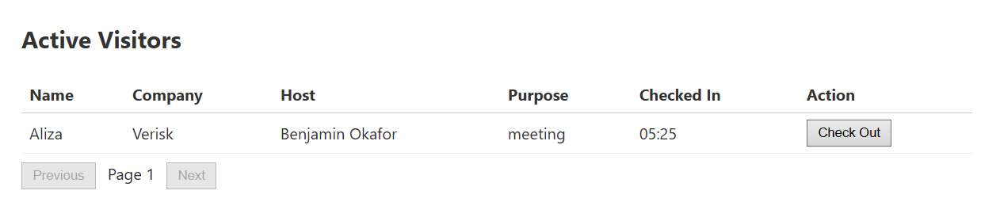

### Defect 2: Visitors are successfully registered even without their "purpose"
- **Summary:** Visitors are successfully registered even without their "purpose."
- **Type:** Functional
- **Description:** The feature states that the visitors are registered with their visit purpose. But the visitors are getting registered and shown in the active list even when their purpose is not specified.
- **Steps to Reproduce:**
  1. Launch the app on the browser.
  2. Navigate to the Visitor Registration form.
  3. Enter the full name.
  4. Enter the company name.
  5. Choose the host.
  6. Leave the "Purpose" field empty.
  7. Click on the "Submit" button.
- **Expected Result:** The form should be stopped from getting submitted and an error prompt should be shown.
- **Actual Result:** The visitor gets registered successfully and can be viewed on the "Active Visitors" list.

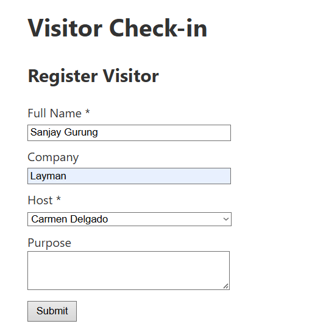
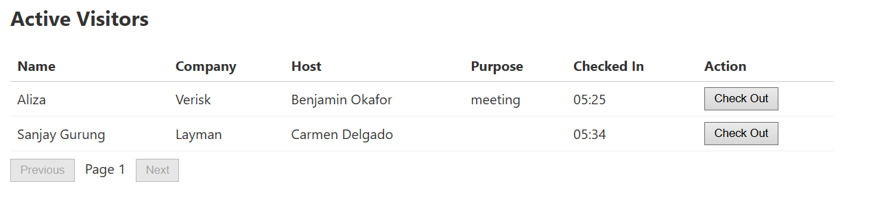

### Defect 3: Visitors are successfully registered when they enter random numbers in the "Full Name" field
- **Summary:** Visitors are successfully registered when they enter random numbers in the "Full Name" field.
- **Type:** Functional
- **Description:** In the "Full Name" field, when random numbers are entered instead of words, the visitors get successfully registered when the "Submit" button is clicked.
- **Steps to Reproduce:**
  1. Launch the app on the browser.
  2. Navigate to the Visitor Registration form.
  3. Enter random numbers in the "Full Name" field. For eg: "1234".
  4. Enter the company name.
  5. Choose the host.
  6. Enter the purpose.
  7. Click on the "Submit" button.
- **Expected Result:** The form should be stopped from getting submitted and an error prompt should be shown when numbers are entered in a text field.
- **Actual Result:** The visitor gets registered successfully and can be viewed on the "Active Visitors" list.
- **Evidence:**
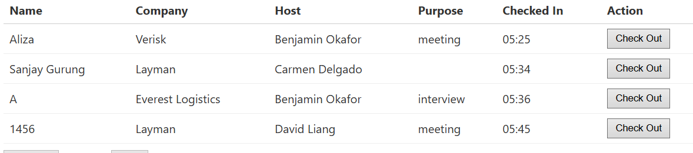

### Defect 4: Visitors are successfully registered when they enter special characters in the "Full Name" field
- **Summary:** Visitors are successfully registered when they enter special characters in the "Full Name" field.
- **Type:** Functional
- **Description:** When special characters like "@#$%^&" are entered in the "Full Name" field instead of an actual name, the visitor gets successfully registered when the "Submit" button is clicked.
- **Steps to Reproduce:**
  1. Launch the app on the browser.
  2. Navigate to the Visitor Registration form.
  3. Enter special characters in the "Full Name" field. For eg: "&*()#$".
  4. Enter the company name.
  5. Choose the host.
  6. Enter the purpose.
  7. Click on the "Submit" button.
- **Expected Result:** The form should be stopped from getting submitted and an error prompt should be shown when special characters are entered in a text field.
- **Actual Result:** The visitor gets registered successfully and can be viewed on the "Active Visitors" list.
- **Evidence:**
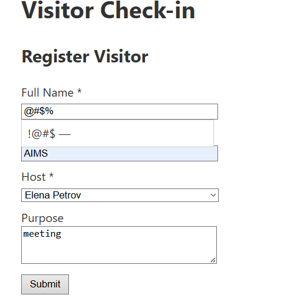
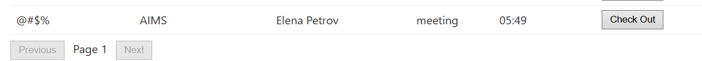

### Defect 5: Visitors are successfully registered when they leave the "Company Name" field empty
- **Summary:** Visitors are successfully registered when they leave the "Company Name" field empty.
- **Type:** Functional
- **Description:** The feature states that the visitors are registered with their company name. But the visitor gets successfully registered and shown in the active list even when their company name is not entered.
- **Steps to Reproduce:**
  1. Launch the app on the browser.
  2. Navigate to the Visitor Registration form.
  3. Enter Full Name.
  4. Leave the "Company Name" field empty.
  5. Choose the host.
  6. Enter the purpose.
  7. Click on the "Submit" button.
- **Expected Result:** The form should be stopped from getting submitted and an error prompt should be shown when the "Company Name" field is left empty.
- **Actual Result:** The visitor gets registered successfully and can be viewed on the "Active Visitors" list.
- **Evidence:**
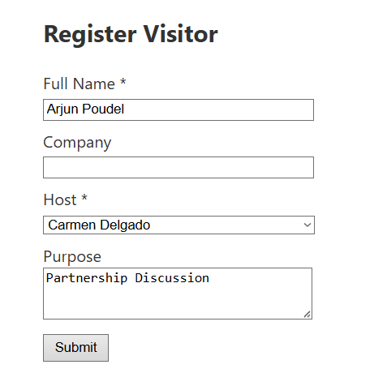
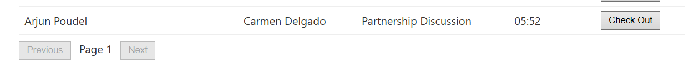

### Defect 6: "Next" page appears whenever the current page is full (20 records), even when no further records actually exist
- **Summary:** "Next" page appears whenever the current page is full (20 records), even when no further records actually exist.
- **Type:** Functional
- **Description:** The active visitor list is paginated at 20 records per page. The app determines whether a "Next" page should be shown based solely on whether the current page contains exactly 20 records, rather than checking whether any visitor records actually exist beyond the current page. As a result, whenever a page has exactly 20 records, a "Next" page becomes accessible and displays as empty, even if no additional visitors exist beyond it. Conversely, whenever a page has fewer than 20 records, "Next" correctly disappears — and reappears again if the page count returns to exactly 20.
- **Steps to Reproduce:**
  1. Register visitors until a page (e.g., page 1) contains exactly 20 records.
  2. Observe that a "Next" page becomes accessible.
  3. Navigate to the "Next" page and confirm it displays an empty table with no visitor records.
  4. Reduce the count on the original page below 20 (e.g., check out one visitor), and confirm "Next" disappears.
  5. Register a new visitor to bring the page count back to exactly 20, and confirm "Next" reappears.
- **Expected Result:** A "Next" page should only be accessible when visitor records actually exist beyond the current page — not simply because the current page happens to contain exactly 20 records.
- **Actual Result:** The "Next" page is shown or hidden based solely on whether the current page has exactly 20 records, regardless of whether any records actually exist beyond it.
- **Evidence:**
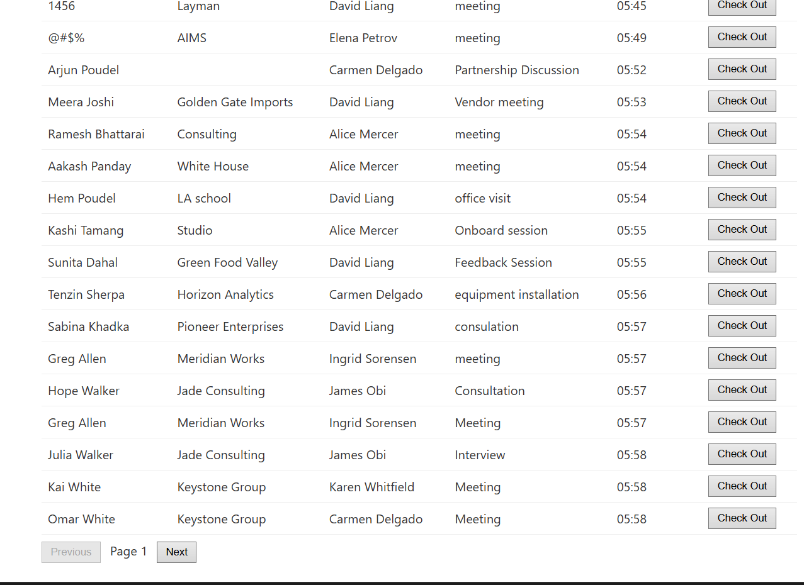
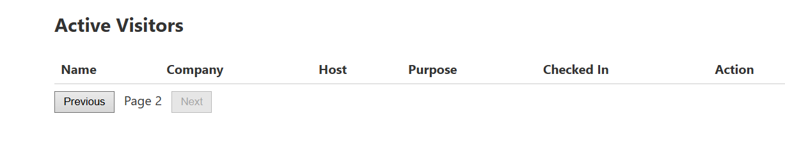

### Defect 7: No button for deactivation of the visitors
- **Summary:** No button for deactivation of the visitors.
- **Type:** Functional
- **Description:** The feature states that administrators can deactivate visitor records. However, no button, admin panel, or any UI element was found in the application that allows an administrator to perform this action.
- **Steps to Reproduce:**
  1. Launch the app on the browser.
  2. Look through the Active Visitors list, navigation menu, and any available pages for a way to deactivate a visitor.
  3. Confirm that no such button or option exists anywhere in the UI.
- **Expected Result:** Administrators should have a way, within the application UI, to deactivate a visitor record.
- **Actual Result:** No UI element exists anywhere in the application for deactivating a visitor.
- **Evidence:**
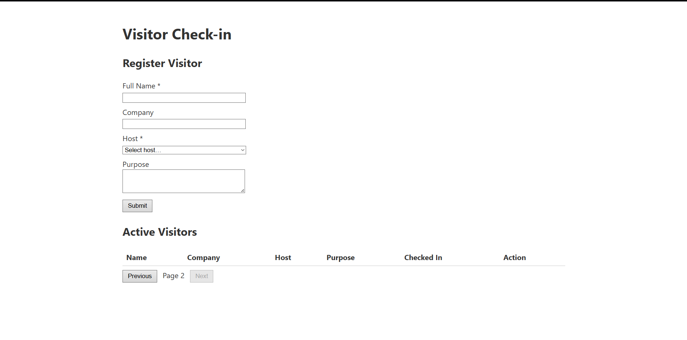

### Defect 8: Check-in time displayed in UTC instead of local (Asia/Kathmandu) timezone
- **Summary:** Check-in time displayed in UTC instead of local (Asia/Kathmandu) timezone.
- **Type:** Functional
- **Description:** The spec states all times should be displayed in the receptionist's local timezone (Asia/Kathmandu). However, the "Checked In" time shown in the Active Visitors list reflects UTC time rather than local time. This is especially misleading near local midnight: a visitor checked in just after midnight local time can display a "Checked In" time from the previous evening, making it appear as though they checked in the day before.
- **Steps to Reproduce:**
  1. Note the current local time on your device.
  2. Navigate to the Visitor Registration form.
  3. Enter the Full Name.
  4. Enter the company name.
  5. Choose the host.
  6. Enter the purpose for the visit.
  7. Observe the "Checked In" time shown for that visitor in the Active Visitors list.
  8. Compare the displayed time to your actual local check-in time.
  
- **Expected Result:** The "Checked In" time should match the actual local time in the receptionist's device.
- **Actual Result:** The displayed time is approximately 5 hours 45 minutes earlier than actual local time, consistent with an unconverted UTC timestamp being shown.
- **Evidence:** 
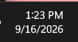
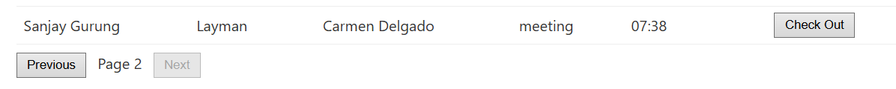

### Defect 10: Visitors can be registered with a single-character name
- **Summary:** A visitor can be registered using just a single character as their full name.
- **Type:** Functional
- **Description:** The Full Name field has no minimum length validation. A visitor was successfully registered using only the single character "A" as their full name.
- **Steps to Reproduce:**
  1. Launch the app on the browser.
  2. Navigate to the Visitor Registration form.
  3. Enter a single character (e.g., "A") in the Full Name field.
  4. Fill in the remaining fields with valid data.
  5. Click Submit.
- **Expected Result:** The form should reject submission and prompt for a valid full name.
- **Actual Result:** The visitor is registered successfully with a single-character name.
- **Evidence:** 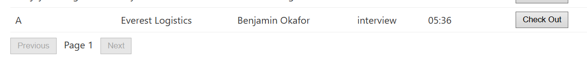

### Defect 11: Visitor creation via API does not save submitted data as all fields stored as null
- **Summary:** Creating a visitor through the help of API results in a record with all submitted fields (full_name, company_name, purpose, host_id) saved as null, despite valid data being sent and a success response returned.
- **Type:** Data
- **Description:** When sending a POST request to the endpoint "/api/visitors" with a complete, correctly formatted payload including full_name, company_name, purpose, and host_id, the API responds with the status code "201 Created" indicating success but the resulting active visitor record has all of these fields set to null. Only the auto-generated id, checked_in_at timestamp, and default active status are created. This indicates the submitted data is not being persisted at all, despite the API reporting success.
- **Steps to Reproduce:**
  1. Send a POST request to http://127.0.0.1:3000/api/visitors with the following JSON body:
     {"visitor":{"full_name":"Santosh Shrestha","company_name":"TestCo","purpose":"Testing","host_id":1}}
  2. Observe the response.
- **Expected Result:** The API should return a 201 Created response with a visitor record containing the actual submitted values for full_name, company_name, purpose, and host_id.
- **Actual Result:** The API returns 201 Created, but full_name, company_name, purpose, and host_id are all null in the response, despite valid values being sent in the request.
- **Evidence:** 
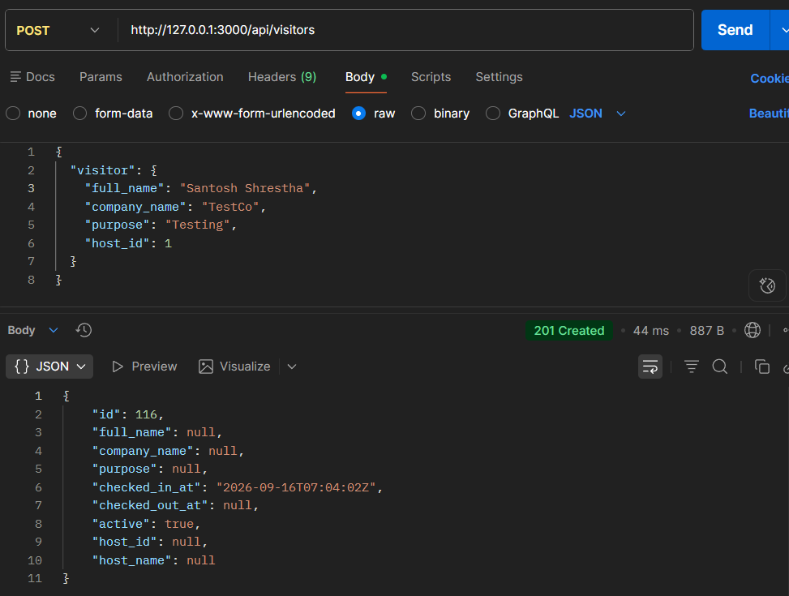
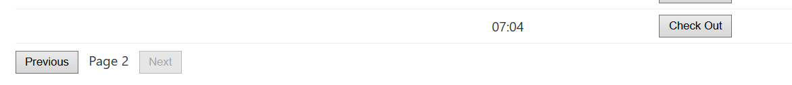

### Defect 12: Deactivated visitors via API endpoint still appear in the Active Visitors list
- **Summary:** A visitor marked as deactivated (active: false) still appears in the Active Visitors list.
- **Type:** Functional
- **Description:** The deactivated visitors must not appear in the active visitors list. However, after deactivating a visitor using the deactivation endpoint , the visitor continues to be displayed in the Active Visitors list. .
- **Steps to Reproduce:**
  1. Register a visitor.
  2. Deactivate that visitor by sending a PATCH request to the deactivation endpoint (http://127.0.0.1:3000/api/visitors/:id/deactivate), since no UI control for deactivation currently exists .
  3. Confirm the visitor's record is returned with "active": false in the API response.
  4. Check the Active Visitors list in the application.
- **Expected Result:** The deactivated visitor should not appear in the Active Visitors list.
- **Actual Result:** The deactivated visitor continues to appear in the Active Visitors list despite being marked inactive. This was reproduced consistently across multiple visitors.
- **Evidence:** 
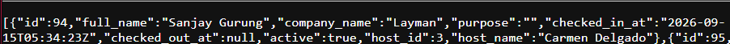

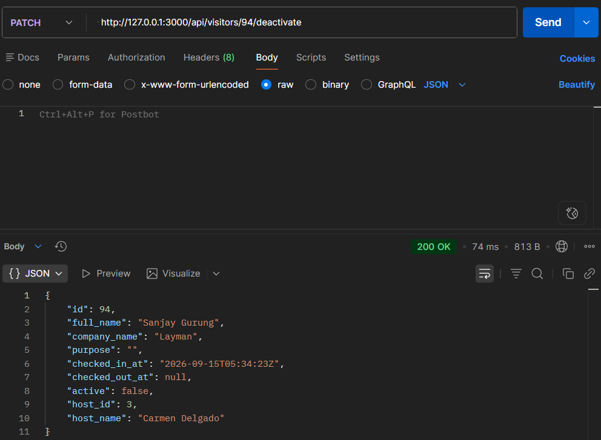

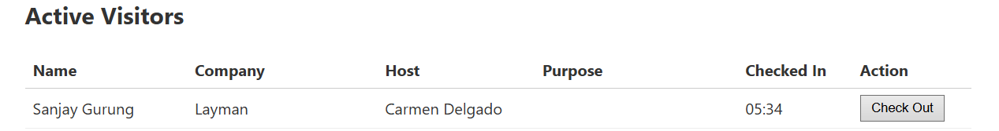

Assumptions/Open Questions?

Concern A: Can the same visitor register multiple times? (duplicate detection)

This is about one real person registering twice.

1. The feature does not specify how the application should distinguish between two different individuals who share the same full name, company, and visit purpose (e.g., two employees from the same company named "Aliza Shrestha," both visiting for a "meeting" on the same day). A visitor with identical details can be registered multiple times, with no way to confirm whether this represents the same person or two different people visiting at the same time. Since no unique identifier (such as an ID number or email) is captured during registration, there is no way to reliably tell these visitors apart in the system. Should the application capture an additional identifying field, or is name-based identification considered sufficient for this use case?

2. The spec does not specify whether pagination state should be preserved across a page refresh. Currently, refreshing the application while viewing a later page (e.g., page 4) resets the view back to page 1, regardless of which page was previously being viewed. Is this the intended behavior, or should the application preserve the current page across a refresh for a better user experience?

